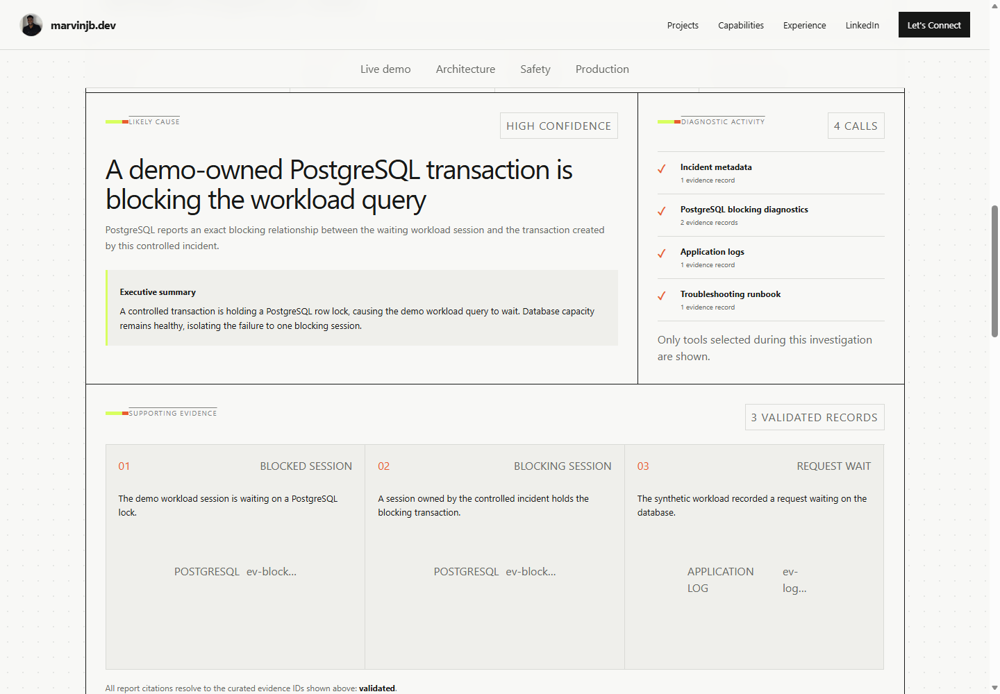
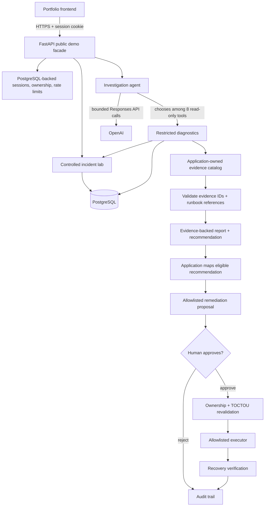

# Incident Investigation Agent

An evidence-grounded AI incident investigation system that diagnoses controlled application and PostgreSQL failures, recommends bounded remediation, requires human approval, and verifies recovery.

**[Try the live demo](https://marvinjb.dev/demo/incident-investigation)**

This is a production-deployed portfolio system built around a controlled synthetic incident lab—not a general autonomous SRE platform. The model investigates through eight read-only, allowlisted tools. It cannot run arbitrary SQL or shell commands and cannot execute remediation. Application policy validates its evidence and recommendation; a human must approve one of three application-owned actions before the executor can act.



## Why this project exists

Incident-response assistants are useful only when their conclusions are traceable and their authority is constrained. This project demonstrates an agent that chooses diagnostics, tests a hypothesis, cites observed evidence, and recommends a response without receiving unrestricted infrastructure access.

It supports three genuine controlled failures:

- a PostgreSQL query blocked by a demo-owned transaction;
- exhaustion of the application's own connection pool while PostgreSQL retains capacity;
- an incompatible `v2-bad` deployment that produces a real PostgreSQL `UndefinedColumn` error.

## System workflow

```text
Controlled incident → bounded investigation → validated evidence-backed report
→ application-owned proposal → human approval → allowlisted execution
→ recovery verification → audit trail
```

This is agentic rather than conversational: the model selects diagnostic tools over multiple bounded turns, observes their results, and produces a structured report. It does not chat freely or receive a general execution environment.

## Architecture and trust boundaries



The model controls diagnostic selection and report generation. Application code controls capabilities, validation, proposal mapping, state revalidation, execution, and recovery checks. The human controls approval. Remediation functions are deliberately absent from the model tool registry.

See [Architecture](docs/ARCHITECTURE.md) for component and lifecycle details.

## Controlled scenarios

| Scenario | Genuine evidence | Allowlisted action |
| --- | --- | --- |
| Blocked query | `pg_blocking_pids()`, lock wait, named demo sessions | `terminate_demo_blocker` |
| Connection-pool exhaustion | live pool saturation, `PoolTimeout`, PostgreSQL capacity | `release_demo_pool_pressure` |
| Bad deployment | active `v2-bad`, deployment timing, genuine `UndefinedColumn` | `rollback_demo_deployment` |

Each incident automatically recovers when its bounded lifetime expires. Production uses the configured maximum of 120 seconds so investigation and a human decision can complete without removing that safety backstop.

## Agent behavior

The investigator initially receives only incident metadata and event tools. It can then choose from eight fixed diagnostics:

1. incident metadata;
2. incident events;
3. bounded application logs;
4. PostgreSQL blocking relationships;
5. PostgreSQL connection utilization;
6. application pool state;
7. recent deployments;
8. the scenario's allowlisted runbook.

Tools accept no arbitrary SQL, path, PID, table, database, version, or shell argument. The default investigation budget is six model calls and ten tool calls, with a 45-second provider-call timeout and 3,000-token response ceiling. One bounded repair turn can correct invalid references; validation is never relaxed.

The structured report contains an executive summary, cited timeline, primary and alternative hypotheses, key evidence, recommendations, uncertainties, runbook references, safe tool activity, and metrics. Every cited evidence ID must exist in the collected catalog, and every runbook reference must have been retrieved during that investigation.

## Safety model

| Boundary | Permitted |
| --- | --- |
| **AI may** | Select allowlisted read-only tools, interpret returned evidence, produce a diagnosis, and recommend an action. |
| **AI may not** | Run arbitrary SQL or shell commands, read arbitrary files, choose a PID or deployment version, approve a proposal, or execute remediation. |
| **Application** | Bind tools to one incident, validate evidence/runbooks, map eligible recommendations to one fixed action, and revalidate ownership and live preconditions. |
| **Human** | Explicitly approve or reject the pending proposal. |
| **Executor** | Run only the approved allowlisted action, verify scenario-specific recovery, and record audit events. |

The public facade also enforces opaque HttpOnly sessions, cross-session denial, database-backed rate limits, one active incident globally, and one running investigation per incident. Internal diagnostic and raw-evidence routes are disabled in production.

See [Security](SECURITY.md) and [API](docs/API.md).

## Evaluation summary

All three scenarios passed the documented offline and controlled production verification criteria.

| Scenario | Diagnosis | Selective tools | Valid evidence | Human approval | Recovery verified |
| --- | --- | --- | --- | --- | --- |
| Blocked PostgreSQL query | Pass | Pass | Pass | Pass | Pass |
| Application pool exhaustion | Pass | Pass | Pass | Pass | Pass |
| Bad deployment | Pass | Pass | Pass | Pass | Pass |

Evaluation checks diagnosis, scenario-relevant tool choice, citation membership, runbook references, model/tool budgets, approval, application-owned action, and recovery—not merely whether the model returned text. See [Evaluation](docs/EVALUATION.md).

## Production deployment

```text
marvinjb.dev → api.marvinjb.dev → Cloudflare/TLS → Nginx
→ FastAPI on 127.0.0.1:8002 → private PostgreSQL container
                                  ↘ OpenAI Responses API
```

The service runs as a non-root container. PostgreSQL has no public host port. Alembic runs before API startup, liveness and database readiness are separate, production CORS is restricted to `https://marvinjb.dev`, and internal routes plus API documentation are disabled.

Production intentionally runs one Uvicorn worker because the genuine pool-exhaustion experiment owns process-local checked-out connections. Multi-worker operation requires a dedicated incident-lab coordinator rather than a fake shared counter.

Deployment remains a controlled manual release process; CI validates but never deploys. See [Deployment](docs/DEPLOYMENT.md).

## Technology stack

| Area | Technologies |
| --- | --- |
| Application | Python 3.12, FastAPI, Pydantic, asyncio |
| AI | OpenAI Responses API, structured outputs, bounded tool calling |
| Data | PostgreSQL 17, psycopg, psycopg-pool, Alembic |
| Operations | Docker, Docker Compose, Nginx, HTTPS, structured JSON logging |
| Quality | pytest, pytest-asyncio, Ruff, GitHub Actions |

## Public API overview

```text
POST /api/demo/incidents
GET  /api/demo/incidents/{incident_id}
POST /api/demo/incidents/{incident_id}/investigate
GET  /api/demo/investigations/{investigation_id}
POST /api/demo/investigations/{investigation_id}/remediation
POST /api/demo/remediations/{proposal_id}/approve
POST /api/demo/remediations/{proposal_id}/execute
GET  /health/live
GET  /health/ready
```

Public requests use an opaque session cookie. Resource ownership is checked on each later operation. Rate-limited responses include `Retry-After`; safe errors include an `X-Request-ID`. See [API documentation](docs/API.md) for payloads and status codes.

## Local development

Prerequisites: Docker with Compose, or Python 3.12 plus PostgreSQL 17.

```bash
cp .env.example .env
docker compose up --build
```

On Windows PowerShell, use `Copy-Item .env.example .env`. The example contains local development defaults and an empty `OPENAI_API_KEY`. Never commit `.env`.

```bash
curl http://localhost:8000/health/live
curl http://localhost:8000/health/ready
curl http://localhost:8000/demo/workload
```

Direct Python development:

```bash
python -m venv .venv
source .venv/bin/activate  # PowerShell: .venv\Scripts\Activate.ps1
python -m pip install -e ".[dev]" -c requirements.lock
alembic upgrade head
uvicorn app.main:app --reload
```

The direct path requires PostgreSQL configured through the environment. See [.env.example](.env.example).

## Testing

Ordinary validation is offline and never calls OpenAI:

```bash
pytest
ruff check .
ruff format --check .
```

`requirements.lock` records the dependency versions used for the verified environment. After intentionally changing dependencies, recreate the environment, verify the suite, and update the lock with `python -m pip freeze --exclude-editable`.

Optional provider and mutating lab checks are documented separately because they must never run automatically in ordinary CI. See [Evaluation](docs/EVALUATION.md) and [Contributing](CONTRIBUTING.md).

## Observability

The application emits structured JSON to stdout and a bounded rotating JSONL file. It records request IDs, safe resource IDs, event types, latency, status, selected tools, result counts, model/tool-call totals, provider error categories, incident events, and remediation audit events.

It does not log credentials, prompts, provider response bodies, evidence contents, unrestricted logs, or hidden reasoning. `/health/live` checks the process; `/health/ready` checks PostgreSQL. Centralized metrics, traces, alerts, and log aggregation are outside this portfolio's scope.

## Deliberate limitations

- Controlled synthetic lab with exactly three incident scenarios.
- Eight read-only diagnostic tools and three bounded remediation actions.
- No arbitrary SQL, shell, filesystem path, PID, or deployment-version capability.
- Single Uvicorn worker in production because the pool experiment owns real process-local resources.
- Anonymous session-scoped public demo rather than enterprise IAM and authenticated actor identity.
- OpenAI dependency for live investigation; offline validation uses fakes/mocks.
- Database-backed public rate limits and one globally active synthetic incident.
- Local structured stdout/JSONL logs rather than centralized enterprise observability.
- No claim of general autonomous SRE behavior or unrestricted infrastructure management.

These constraints are intentional. The horizontal-scaling path is a dedicated incident-lab coordinator behind stateless API workers.

## Documentation

- [Architecture](docs/ARCHITECTURE.md)
- [Evaluation](docs/EVALUATION.md)
- [Public API](docs/API.md)
- [Deployment and operations](docs/DEPLOYMENT.md)
- [Lessons learned](docs/LESSONS_LEARNED.md)
- [Security](SECURITY.md)
- [Contributing](CONTRIBUTING.md)
- [Runbooks](runbooks/)

## Lessons learned

The project exposed practical failures that changed its design: indiscriminate tool use, invented evidence/runbook references, timeouts shorter than the human workflow, Host-header-sensitive health checks, a synthetic deployment that initially failed to generate real evidence, and a stale release pointer despite healthy containers.

See [Lessons learned](docs/LESSONS_LEARNED.md) for the resulting engineering decisions.

## License

No open-source license has been selected. The repository is publicly inspectable portfolio source but should not be treated as licensed open-source software.
