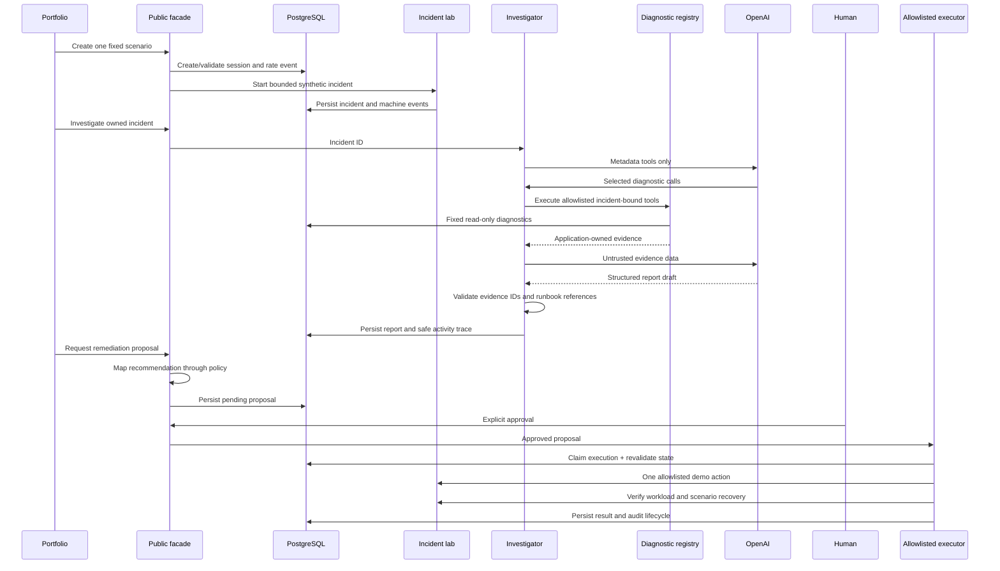

# Architecture

## Design objective

The system lets an AI investigator gather evidence and recommend a response without giving the model general infrastructure authority. Model reasoning, application policy, human approval, and execution are separate trust boundaries.

## Components

- **Portfolio frontend:** recruiter-facing workflow at `marvinjb.dev`.
- **Public FastAPI facade:** issues an opaque session cookie and returns curated incident, investigation, and remediation views.
- **Public store:** persists session ownership, atomic rate limits, and coordination records in PostgreSQL.
- **Incident lab:** creates one of three fixed synthetic failures and retains automatic recovery.
- **Investigator:** runs the bounded model/tool loop through an application-owned provider protocol.
- **Diagnostic registry:** exposes eight incident-bound, argument-free, read-only tools.
- **Evidence layer:** normalizes source facts into application-owned `EvidenceItem` records.
- **Report validator:** rejects unknown evidence IDs and runbook references.
- **Remediation policy:** maps an eligible recommendation to one application-owned action.
- **Human approval:** changes a pending proposal to approved; the model cannot cross this boundary.
- **Executor:** revalidates ownership and live preconditions, executes one bounded action, verifies recovery, and records audit events.

## Technical flow



## Incident lifecycle

An incident moves through `starting`, `active`, `recovering`, and `resolved`, with `failed` for safe setup/recovery failures. Only one synthetic incident may be active globally. PostgreSQL stores coordination state; the process owns the live tasks/connections that create each failure. Automatic recovery runs when the bounded lifetime expires.

The scenarios are fixed in application code. A caller chooses only the scenario through the public API; internal development routes optionally accept a bounded duration.

## Investigation lifecycle

1. Validate that the incident exists.
2. Atomically claim one running investigation for that incident.
3. Give the model incident metadata/event tools first.
4. Expose the full eight-tool registry after initial context.
5. Execute only tool names and empty argument objects accepted by the registry.
6. Normalize returned facts as evidence.
7. Request a strict structured report.
8. Validate every cited evidence ID and retrieved runbook reference.
9. Allow at most one bounded correction for invalid references.
10. Persist the validated report or a safe error category and tool trace.

The default ceilings are six model calls, ten diagnostic calls, 45 seconds per provider call, and 3,000 output tokens.

## Diagnostic registry

The model may select incident metadata, incident events, bounded incident logs, PostgreSQL blocking, PostgreSQL connection utilization, application pool state, recent deployments, and the scenario's allowlisted runbook.

The registry binds the incident ID when it is created. The model cannot supply SQL, tables, paths, log expressions, PIDs, deployment versions, or a remediation command. Tool results are marked as untrusted data so content cannot create new instructions or capabilities.

## Evidence and validation

`EvidenceItem` records identify source, type, timestamp, incident, bounded factual summary, sanitized details, and reference. IDs are deterministic application-generated hashes of canonical source data.

The final report may interpret evidence, but every citation must resolve to the investigation's evidence catalog, every runbook reference must be the exact reference returned by the runbook tool, structured models forbid extra fields, and recommendations cannot claim execution already occurred. Unsupported references fail rather than being fuzzily matched.

No hidden reasoning is stored. The persisted activity trace contains only tool name, status, timestamp, and bounded result count.

## Provider boundary

`InvestigationProvider` is an application-owned protocol. `OpenAIInvestigationProvider` is the only provider-specific adapter and uses the Responses API with strict function definitions and structured output. API routes and diagnostic tools do not call the OpenAI SDK directly.

## Remediation boundaries

Remediation is not an AI tool. Application policy can create only `terminate_demo_blocker`, `release_demo_pool_pressure`, or `rollback_demo_deployment`.

A proposal begins in `pending_approval`, expires after a bounded TTL, and requires an explicit approval request. Execution atomically claims it, checks ownership and current conditions again, and never accepts a caller-provided PID or version. Repeated execution of a completed action returns its existing result; failed execution is not automatically retried.

Success requires a resolved incident, healthy workload, and the scenario-specific condition. Audit events cover proposal, approval, execution, verification, failure, rejection, and expiration.

## Persistence

PostgreSQL stores incident/deployment events, investigations, remediation state/audit events, public sessions, rate events, and uniqueness coordination. Alembic owns production schema migration. Application startup does not run DDL.

Structured logs go to stdout and a bounded rotating JSONL file. The public API never exposes unrestricted logs or raw diagnostic details.

## Production topology

```text
Browser → Cloudflare/TLS → Nginx → 127.0.0.1:8002
                                  → non-root FastAPI container
                                  → private PostgreSQL 17 container
                                  → OpenAI Responses API
```

Only `/api/demo/*`, `/health/live`, and `/health/ready` are routed to this service. Internal `/demo/*` routes and OpenAPI documentation are disabled in production. PostgreSQL has no host port.

## Single-worker rationale and scaling path

Production requires exactly one Uvicorn worker. The pool-exhaustion scenario holds genuine connections in the creating process, so another worker could not safely observe or release that task. PostgreSQL-backed coordination does not change this ownership fact.

If horizontal scale becomes necessary, move synthetic resource ownership into a dedicated incident-lab coordinator/service. Stateless API workers would send typed, database-coordinated commands to it. The genuine pool failure should not be replaced with a fake counter merely to claim multi-worker support.
